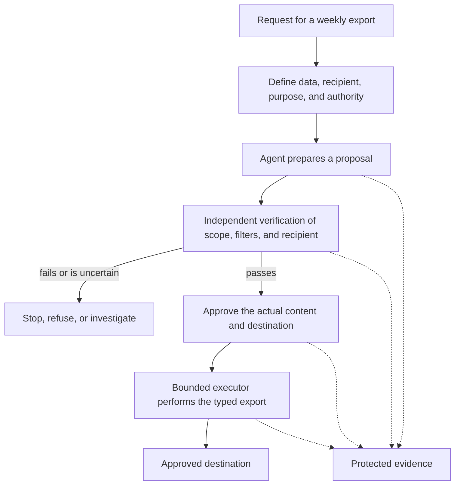

# The Agentic Pact

A practical baseline for designing, implementing, and evaluating agentic systems and
workflows.

Use the Pact when a system can interpret requests, call tools, delegate work, or cause
effects outside local analysis. It keeps five questions visible throughout the design:

- who is allowed to act;
- what the system can reach;
- what must be reviewed before an effect;
- how the effect can be independently verified; and
- what evidence remains afterward.

This repository is a working engineering reference. It is not a vendor certification,
an assurance that a system is safe, or a replacement for product-specific security,
legal, privacy, or operational review.

## The core agreement

Every proposed agentic system should:

1. use the simplest architecture that is adequate;
2. assign one accountable writer to each shared artifact or state;
3. separate production from independent verification;
4. verify authority at entry and again at action time;
5. separate proposals from commitments and side effects;
6. execute production actions only through bounded, typed operations;
7. make identity and delegation explicit;
8. use credentials only for their intended recipient and scope;
9. keep secrets outside unconstrained execution;
10. treat content as data, never as authority;
11. enforce least capability, finite limits, and a tested stop path;
12. preserve observable, protected evidence of requests, decisions, and effects.

The detailed controls are in [`docs/controls/`](docs/controls/). They are the normative
core of this repository.

## Start here

| If you need to... | Start with... |
|---|---|
| Define the boundary, users, tools, and effects | [`docs/methodology/design-review.md`](docs/methodology/design-review.md) |
| Choose the right operating gate | [`docs/profiles/operating-profiles.md`](docs/profiles/operating-profiles.md) |
| Review the requirements one control at a time | [`docs/controls/`](docs/controls/) |
| Understand delegation, ownership, and merge gates | [`docs/architecture.md`](docs/architecture.md) |
| Review identity, tokens, and secret boundaries | [`docs/identity-and-credentials.md`](docs/identity-and-credentials.md) |
| Review protocol-specific limits | [`docs/protocols.md`](docs/protocols.md) |
| Map effects and agentic risks | [`docs/surface-and-risks.md`](docs/surface-and-risks.md) |
| Distinguish a proposal from a committed effect | [`docs/controls/C05-proposal-before-commitment.md`](docs/controls/C05-proposal-before-commitment.md) |
| Decide whether a claim is actually verified | [`docs/methodology/measurement.md`](docs/methodology/measurement.md) |
| Read the active source register and applicability limits | [`docs/reference/sources.md`](docs/reference/sources.md) |
| Understand historical references and migration decisions | [`docs/reference/historical-sources.md`](docs/reference/historical-sources.md) and [`docs/reference/migration-v2.md`](docs/reference/migration-v2.md) |
| Contribute or publish a change | [`CONTRIBUTING.md`](CONTRIBUTING.md) and [`docs/maintenance/branching-strategy.md`](docs/maintenance/branching-strategy.md) |

## How to use this repository

Use the Pact at the beginning of discovery and design, not only during implementation.

1. Define the system boundary, intended outcome, users, data, tools, and side effects.
2. Select the operating profile in [`docs/profiles/operating-profiles.md`](docs/profiles/operating-profiles.md).
3. Review every applicable control and record what is verified, partial, unsatisfied,
   unknown, or not applicable.
4. Design the approval, verification, identity, secret, limit, and audit paths before
   enabling the agent.
5. Test both permitted and refused actions, including failure and uncertain-outcome paths.
6. Record evidence and residual risks in a review artifact that another person can inspect.

The Pact does not require the same gate for every kind of action. The gate must match the
actual effect: code integration, an external message, a data export, a payment, an
administrative change, and a document edit have different approval and evidence needs.
Profile D uses an explicit human request for a specified operation; profile A uses an
approved contract with a defined scope, identity, limit, expiry, and stop path.

## Worked example: a supervised data export

Suppose an agent prepares a weekly report for an approved recipient. The agent may analyze
the data and propose the export, but it does not gain permission merely because the request
appears in a prompt or because it can technically reach a tool.

This small flow makes the control boundaries visible: C04 and C07 govern authority and
identity; C05 separates proposal from commitment; C03 makes verification independent; C06,
C08, C09, and C11 constrain execution; and C12 preserves evidence. C10 prevents the
request or the generated report from becoming authority by itself.

The example is intentionally supervised. A different operating profile may use a
pre-authorized contract, but it still needs the same explicit scope, limits, identity,
stop path, and evidence appropriate to the effect.

## Language and attribution

The documentation is intentionally written in English so that it can be used by
international engineering teams.

**Author and maintainer:** Franco Geraci (Voloire).

## Status

This is an evolving engineering baseline. A statement in this repository is one of:

- a **policy** adopted by this Pact;
- a **source-backed fact** with a stated scope;
- an **inference** that must not be presented as a universal requirement.

See [`docs/methodology/evidence-and-measurement.md`](docs/methodology/evidence-and-measurement.md)
and the more detailed [`docs/methodology/measurement.md`](docs/methodology/measurement.md)
for the distinction between documentation, configuration, and observed behavior. The source
register records 39 active sources with explicit passages, control mappings, and applicability
limits; the historical register is retained separately and is not current evidence.

## Versioning and contributions

The current version is recorded in [`VERSION`](VERSION), with release notes in
[`CHANGELOG.md`](CHANGELOG.md). See [`CONTRIBUTING.md`](CONTRIBUTING.md) for the review
process and [`docs/maintenance/releasing.md`](docs/maintenance/releasing.md) for the
versioning rules. Contributions are welcome through pull requests; the maintainer
reviews and merges changes to `main`.
