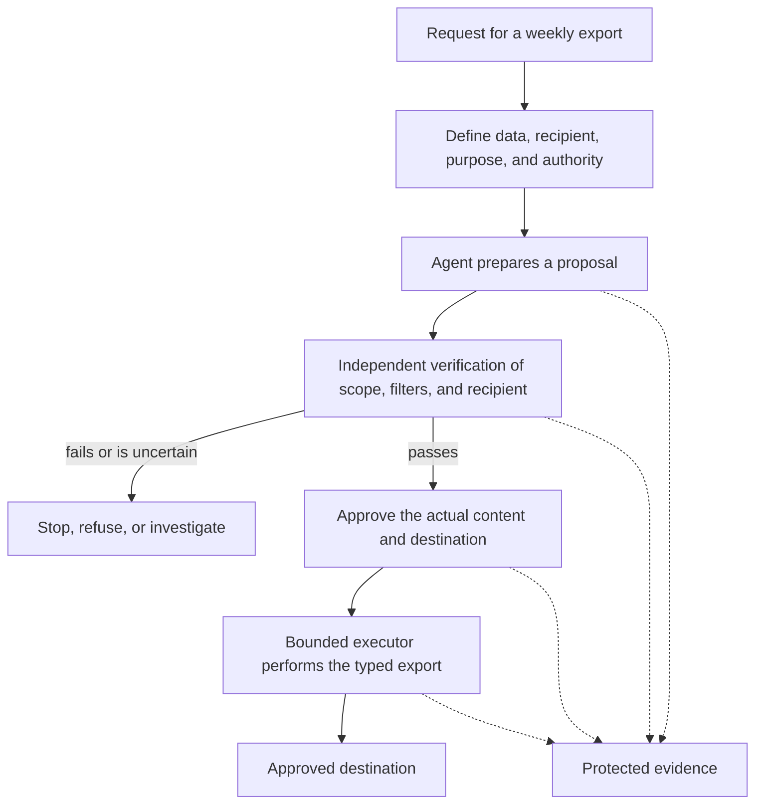

# The Agentic Pact

A practical baseline for designing, implementing, and evaluating agentic systems and
workflows.

Use the Pact when a system can interpret requests, call tools, delegate work, or cause
effects outside local analysis. It keeps five questions visible throughout the design:

- who is allowed to act;
- what the system can reach;
- what must be reviewed before an effect;
- how the effect can be independently verified; and
- what evidence remains afterward.

This repository is a working engineering reference. It is not a vendor certification,
an assurance that a system is safe, or a replacement for product-specific security,
legal, privacy, or operational review.

## The core agreement

Every proposed agentic system should:

1. use the simplest architecture that is adequate;
2. assign one accountable writer to each shared artifact or state;
3. separate production from independent verification;
4. verify authority at entry and again at action time;
5. separate proposals from commitments and side effects;
6. execute production actions only through bounded, typed operations;
7. make identity and delegation explicit;
8. use credentials only for their intended recipient and scope;
9. keep secrets outside unconstrained execution;
10. treat content as data, never as authority;
11. enforce least capability, finite limits, and a tested stop path;
12. preserve observable, protected evidence of requests, decisions, and effects.

The detailed controls are in [`docs/controls/`](docs/controls/). They are the normative
core of this repository.

## Start here

| If you need to... | Start with... |
|---|---|
| Define the boundary, users, tools, and effects | [`docs/methodology/design-review.md`](docs/methodology/design-review.md) |
| Choose the right operating gate | [`docs/profiles/operating-profiles.md`](docs/profiles/operating-profiles.md) |
| Review the requirements one control at a time | [`docs/controls/`](docs/controls/) |
| Understand delegation, ownership, and merge gates | [`docs/architecture.md`](docs/architecture.md) |
| Review identity, tokens, and secret boundaries | [`docs/identity-and-credentials.md`](docs/identity-and-credentials.md) |
| Review protocol-specific limits | [`docs/protocols.md`](docs/protocols.md) |
| Map effects and agentic risks | [`docs/surface-and-risks.md`](docs/surface-and-risks.md) |
| Distinguish a proposal from a committed effect | [`docs/controls/C05-proposal-before-commitment.md`](docs/controls/C05-proposal-before-commitment.md) |
| Decide whether a claim is actually verified | [`docs/methodology/measurement.md`](docs/methodology/measurement.md) |
| Read the active source register and applicability limits | [`docs/reference/sources.md`](docs/reference/sources.md) |
| Understand historical references and migration decisions | [`docs/reference/historical-sources.md`](docs/reference/historical-sources.md) and [`docs/reference/migration-v2.md`](docs/reference/migration-v2.md) |
| Contribute or publish a change | [`CONTRIBUTING.md`](CONTRIBUTING.md) and [`docs/maintenance/branching-strategy.md`](docs/maintenance/branching-strategy.md) |

## Source foundations

The Pact is a local policy informed by external research, standards, and vendor
documentation. The complete active source set is visible below. These links are provenance,
not vendor endorsement. Protocol requirements remain scoped to their protocol, version, and
role. The [full source registry](docs/reference/sources.md) adds dates, passages, limits, and
revalidation status; the [historical registry](docs/reference/historical-sources.md) is
separate and is not current evidence.

| ID | Source | Informs |
|---|---|---|
| F01 | [Anthropic — Building multi-agent systems](https://claude.com/blog/building-multi-agent-systems-when-and-how-to-use-them) | C01–C03: simplicity, independent work, verification |
| F02 | [Cognition — Multi-Agents: What's Actually Working](https://cognition.com/blog/multi-agents-working) | C01–C03: independent review, single writer |
| F03 | [OWASP — LLM06:2025 Excessive Agency](https://genai.owasp.org/llmrisk/llm062025-excessive-agency/) | C04–C07, C10–C11: least privilege and constrained autonomy |
| F04 | [OWASP — Top 10 for Agentic Applications 2026](https://genai.owasp.org/resource/owasp-top-10-for-agentic-applications-for-2026/) | C04–C12: ASI01–ASI10 risk taxonomy |
| F05 | [OWASP — Authorization Cheat Sheet](https://cheatsheetseries.owasp.org/cheatsheets/Authorization_Cheat_Sheet.html) | C04–C07, C12: deny-by-default and per-request checks |
| F06 | [OWASP — Logging Cheat Sheet](https://cheatsheetseries.owasp.org/cheatsheets/Logging_Cheat_Sheet.html) | C12: event attributes, exclusions, verification, protection |
| F07 | [OWASP — Transaction Authorization Cheat Sheet](https://cheatsheetseries.owasp.org/cheatsheets/Transaction_Authorization_Cheat_Sheet.html) | C04–C06, C12: approval bound to transaction data |
| F08 | [Google Identity — OAuth 2.0](https://developers.google.com/identity/protocols/oauth2) | C07, C09: user delegation and application flows |
| F09 | [Google IAM — Service account impersonation](https://docs.cloud.google.com/iam/docs/service-account-impersonation) | C07: temporary credentials and federation |
| F10 | [RFC 9700 — OAuth 2.0 Security Best Current Practice](https://www.rfc-editor.org/rfc/rfc9700.html) | C07–C09: token and refresh-token protection |
| F11 | [OWASP NHI7:2025 — Long-Lived Secrets](https://owasp.github.io/www-project-non-human-identities-top-10/2025/7-long-lived-secrets/) | C07, C09: excessive credential persistence |
| F12 | [OWASP NHI10:2025 — Human Use of NHI](https://owasp.github.io/www-project-non-human-identities-top-10/2025/10-human-use-of-nhi/) | C07: people using non-human identities |
| F13 | [GitHub — Installation access token](https://docs.github.com/en/apps/creating-github-apps/authenticating-with-a-github-app/generating-an-installation-access-token-for-a-github-app) | C07: installation lifetime and permissions |
| F14 | [Git — git-commit](https://git-scm.com/docs/git-commit) | C07, C12: author and committer metadata |
| F15 | [GitHub — Commit signature verification](https://docs.github.com/en/authentication/managing-commit-signature-verification/about-commit-signature-verification) | C07, C12: signatures distinct from push identity |
| F16 | [GitHub — Available rules for rulesets](https://docs.github.com/en/repositories/configuring-branches-and-merges-in-your-repository/managing-rulesets/available-rules-for-rulesets) | C05: pull requests and required checks |
| F17 | [GitHub — Managing rulesets](https://docs.github.com/en/repositories/configuring-branches-and-merges-in-your-repository/managing-rulesets/managing-rulesets-for-a-repository) | C05: ruleset administration and bypass limits |
| F18 | [GitHub REST — Merge a pull request](https://docs.github.com/en/rest/pulls/pulls#merge-a-pull-request) | C05, C07: merge permissions and installation tokens |
| F19 | [GitHub — Troubleshooting required status checks](https://docs.github.com/en/pull-requests/how-tos/merge-and-close-pull-requests/troubleshooting-required-status-checks) | C03, C05: current-SHA and skipped-check behavior |
| F20 | [GitHub — Copilot cloud-agent risks and mitigations](https://docs.github.com/en/copilot/concepts/agents/cloud-agent/risks-and-mitigations) | C04–C05, C09–C11: product-specific agent controls |
| F21 | [Invariant — GitHub MCP Exploited](https://invariantlabs.ai/blog/mcp-github-vulnerability) | C04, C07, C10: public-to-private exfiltration demonstration |
| F22 | [Comment and Control](https://oddguan.com/blog/comment-and-control-prompt-injection-credential-theft-claude-code-gemini-cli-github-copilot/) | C09–C10: process boundaries and output exfiltration research |
| F23 | [Nx — S1ngularity postmortem](https://nx.dev/blog/s1ngularity-postmortem) | C06, C09–C11: workflow injection and token theft incident |
| F24 | [OpenAI — Agent approvals and security](https://learn.chatgpt.com/docs/agent-approvals-security) | C09, C11: sandbox and approval separation |
| F25 | [OpenAI — Cloud environments](https://learn.chatgpt.com/docs/environments/cloud-environment) | C09: configured secrets and environment boundaries |
| F26 | [GitHub — Push protection](https://docs.github.com/en/code-security/concepts/secret-security/push-protection) | C10, C12: supported secret-pattern detection limits |
| F27 | [MCP — Versioning and Compatibility](https://modelcontextprotocol.io/specification/2026-07-28/basic/versioning) | C08: version negotiation and compatibility |
| F28 | [MCP — Authorization](https://modelcontextprotocol.io/specification/2026-07-28/basic/authorization/index) | C07–C09: HTTP authorization and token handling |
| F29 | [MCP — Authorization Security Considerations](https://modelcontextprotocol.io/specification/2026-07-28/basic/authorization/security-considerations) | C08–C09: audience binding and token theft |
| F30 | [MCP — OAuth Client Credentials](https://modelcontextprotocol.io/extensions/auth/oauth-client-credentials) | C07–C08: machine-to-machine authorization |
| F31 | [MCP — Enterprise-Managed Authorization](https://modelcontextprotocol.io/extensions/auth/enterprise-managed-authorization) | C07–C08: enterprise delegation and ID-JAG exchange |
| F32 | [A2A — Release v1.0.1](https://github.com/a2aproject/A2A/releases/tag/v1.0.1) | C08: protocol patch corrections |
| F33 | [A2A — Current specification](https://a2a-protocol.org/latest/specification/) | C04, C07–C08, C12: versioning, authorization, audit |
| F34 | [Agent Control Standard — repository](https://github.com/GenAI-Security-Project/agent-control-standard) | C04, C11–C12: emerging runtime-control limits |
| F35 | [OWASP — LLM Top 10 2026](https://genai.owasp.org/resource/owasp-genai-llm-top-10-2026/) | C04–C07, C10–C11: user context and mediation |
| F36 | [OWASP — File Upload Cheat Sheet](https://cheatsheetseries.owasp.org/cheatsheets/File_Upload_Cheat_Sheet.html) | C10–C11: active content, validation, isolation |
| F37 | [MCP — Logging](https://modelcontextprotocol.io/specification/2026-07-28/server/utilities/logging) | C12: protocol logging limits and persistence |
| F38 | [MCP — Specification](https://modelcontextprotocol.io/specification/2026-07-28) | C04–C05, C08: protocol enforcement limits |
| F39 | [GitHub Actions — Secure use reference](https://docs.github.com/en/actions/reference/security/secure-use) | C04–C05, C09–C11: workflow permissions, secrets, scripts |

**Complementary links:** [OWASP Agentic Applications PDF](https://genai.owasp.org/download/52117/?tmstv=1765059207), [MCP Versioning guide](https://modelcontextprotocol.org/docs/2026-07-28/learn/versioning), [MCP Security Best Practices](https://modelcontextprotocol.org/docs/2026-07-28/tutorials/security/security_best_practices), [OWASP ACS presentation](https://genai.owasp.org/resource/agent-control-standard-acs/), and [OWASP LLM 2026 PDF](https://genai.owasp.org/download/56857/?tmstv=1785822482).

The external sources do not certify this repository or any implementation. Requirements
marked as Pact policy are decisions adopted here, with source scope and limitations recorded
in the full registry.

## How to use this repository

Use the Pact at the beginning of discovery and design, not only during implementation.

1. Define the system boundary, intended outcome, users, data, tools, and side effects.
2. Select the operating profile in [`docs/profiles/operating-profiles.md`](docs/profiles/operating-profiles.md).
3. Review every applicable control and record what is verified, partial, unsatisfied,
   unknown, or not applicable.
4. Design the approval, verification, identity, secret, limit, and audit paths before
   enabling the agent.
5. Test both permitted and refused actions, including failure and uncertain-outcome paths.
6. Record evidence and residual risks in a review artifact that another person can inspect.

The Pact does not require the same gate for every kind of action. The gate must match the
actual effect: code integration, an external message, a data export, a payment, an
administrative change, and a document edit have different approval and evidence needs.
Profile D uses an explicit human request for a specified operation; profile A uses an
approved contract with a defined scope, identity, limit, expiry, and stop path.

## Worked example: a supervised data export

Suppose an agent prepares a weekly report for an approved recipient. The agent may analyze
the data and propose the export, but it does not gain permission merely because the request
appears in a prompt or because it can technically reach a tool.

This small flow makes the control boundaries visible: C04 and C07 govern authority and
identity; C05 separates proposal from commitment; C03 makes verification independent; C06,
C08, C09, and C11 constrain execution; and C12 preserves evidence. C10 prevents the
request or the generated report from becoming authority by itself.

The example is intentionally supervised. A different operating profile may use a
pre-authorized contract, but it still needs the same explicit scope, limits, identity,
stop path, and evidence appropriate to the effect.

## Language and attribution

The documentation is intentionally written in English so that it can be used by
international engineering teams.

**Author and maintainer:** Franco Geraci (Voloire).

## Status

This is an evolving engineering baseline. A statement in this repository is one of:

- a **policy** adopted by this Pact;
- a **source-backed fact** with a stated scope;
- an **inference** that must not be presented as a universal requirement.

See [`docs/methodology/evidence-and-measurement.md`](docs/methodology/evidence-and-measurement.md)
and the more detailed [`docs/methodology/measurement.md`](docs/methodology/measurement.md)
for the distinction between documentation, configuration, and observed behavior. The source
register records 39 active sources with explicit passages, control mappings, and applicability
limits; the historical register is retained separately and is not current evidence.

## Versioning and contributions

The current version is recorded in [`VERSION`](VERSION), with release notes in
[`CHANGELOG.md`](CHANGELOG.md). See [`CONTRIBUTING.md`](CONTRIBUTING.md) for the review
process and [`docs/maintenance/releasing.md`](docs/maintenance/releasing.md) for the
versioning rules. Contributions are welcome through pull requests; the maintainer
reviews and merges changes to `main`.
